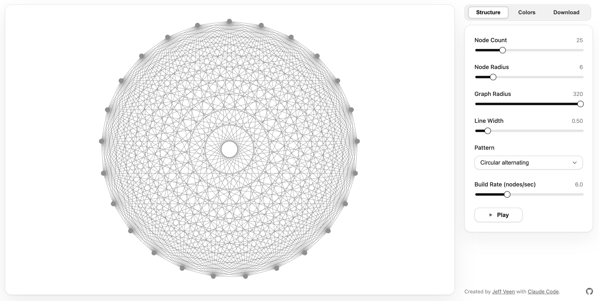

# Metcalfe's Law Visualizaion Generator

Interactive visualization of networks inspired by Metcalfe's Law. Open `index.html` in a modern browser or serve the repo statically (`python3 -m http.server 8000`). Controls in the right pane let you tweak structure, colors, and download a capture. See `AGENTS.md` for contributor guidelines.

Licensed under the [MIT License](LICENSE).